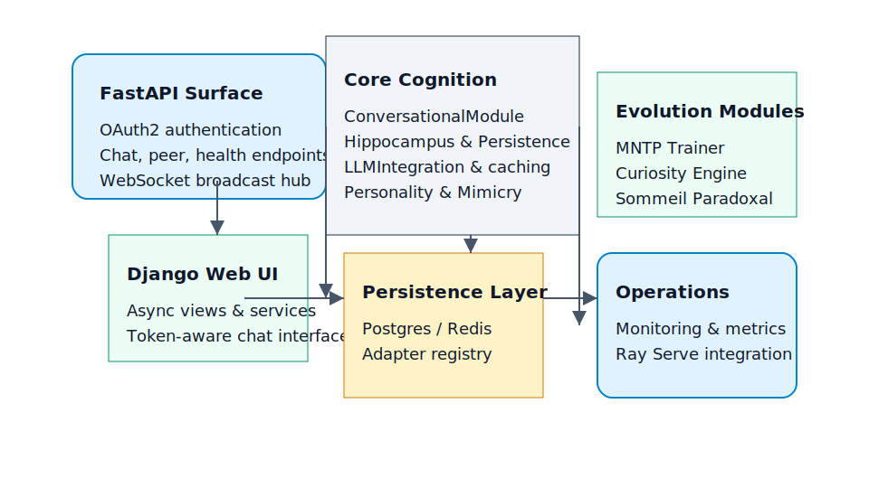
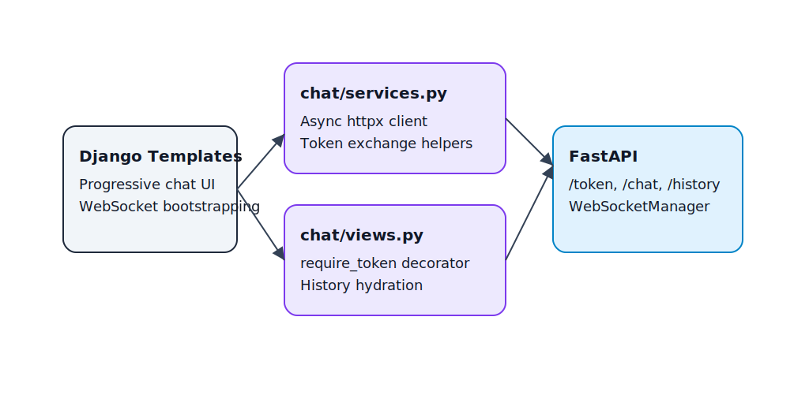
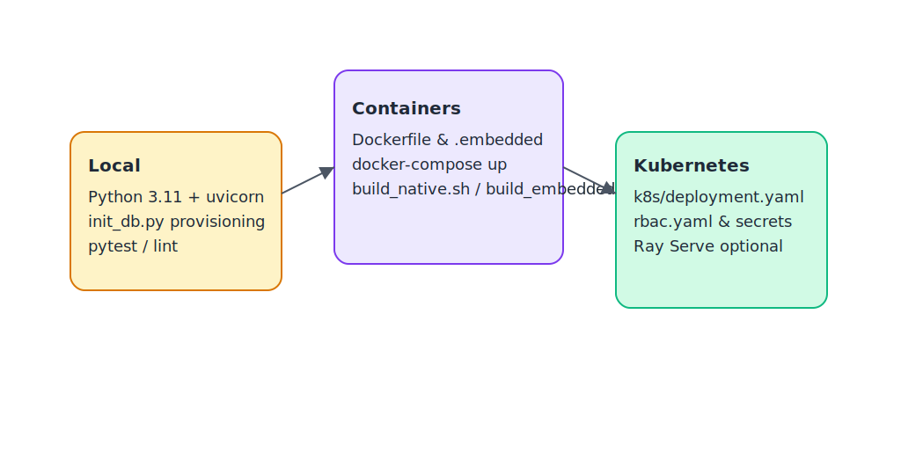

# monGARS

**monGARS** (Modular Neural Guardian for Autonomous Research & Support) is a
privacy-first AI assistant designed for resilient deployment on workstations,
edge appliances, and research clusters. The project combines a FastAPI service,
adaptive cognition pipeline, Django operator console, and optional ML training
modules so contributors can experiment end-to-end without bespoke tooling.

## Table of Contents
1. [Project Snapshot](#project-snapshot)
2. [Project Health](#project-health)
3. [Architecture at a Glance](#architecture-at-a-glance)
4. [Functional Snapshots](#functional-snapshots)
5. [Service Breakdown](#service-breakdown)
6. [Getting Started](#getting-started)
7. [Configuration Keys](#configuration-keys)
8. [Operational Workflows](#operational-workflows)
9. [Deployment Options](#deployment-options)
10. [Security & Observability](#security--observability)
11. [Documentation Map](#documentation-map)
12. [Contributing](#contributing)

## Project Snapshot
- **Conversational engine** with memory-backed context, curiosity-driven
  research, and style adaptation.
- **Memory architecture** that blends in-memory `Hippocampus`, SQL persistence,
  and Redis/disk caching layers.
- **Evolution engine** to retrain adapters, roll out artefacts, and trigger safe
  optimisations during idle windows.
- **Self-improvement loop** where personality profiles persist via SQLModel and
  refresh through LoRA-style adapters, while SelfTrainingEngine now feeds the
  MNTP trainer for curated batches and materialises deterministic adapters when
  heavyweight ML dependencies are unavailable.
- **Web interface** powered by Django async views that proxy authentication and
  chat history to FastAPI.
- **Hardware-aware operations** with worker tuning for Raspberry Pi/Jetson,
  container build scripts for multiple architectures, and Kubernetes manifests.
- **Repository-aware RAG enrichment** that augments `/ask`, `/review`, and
  compliance flows when `rag_enabled` is set.

## Project Health
- **Phase 5 – Web/API Refinement**: REST, WebSocket, and Django operator flows
  are production-ready, credential bootstrap now relies solely on persisted
  accounts, and the SDK publishing milestone remains open.【F:monGARS/api/web_api.py†L43-L84】【F:docs/codebase_status_report.md†L76-L108】
- **Phase 6 – Self-Improvement & Research**: Automated MNTP self-training and
  reinforcement-learning loops exist, yet integration with operational rollout
  controls and long-haul observability keeps the milestone in progress.【F:monGARS/core/self_training.py†L1-L160】【F:modules/neurons/training/reinforcement_loop.py†L320-L520】【F:docs/codebase_status_report.md†L109-L144】
- **Open Risks**: Prioritise packaging the Python/TypeScript SDKs and defining
  reinforcement-learning rollout guardrails before closing the remaining
  roadmap items.【F:docs/codebase_status_report.md†L145-L188】

See [docs/codebase_status_report.md](docs/codebase_status_report.md) for the full
audit of runtime modules, tests, and deployment assets.【F:docs/codebase_status_report.md†L1-L188】

## Architecture at a Glance


The system is intentionally modular:
- **FastAPI surface (`monGARS.api`)** exposes OAuth2 authentication, chat,
  conversation history, and peer-management endpoints. WebSockets are mediated by
  a dedicated manager so broadcasts remain consistent, and Ray Serve requests are
  issued directly with per-endpoint retries when distributed inference is
  enabled.
- **Core cognition (`monGARS.core`)** orchestrates Hippocampus memory, curiosity
  heuristics, neuro-symbolic reasoning, LLM adapters (Ollama or Ray Serve), and
  personality/mimicry engines.
- **Optional modules (`modules/`)** host the evolution engine, neuron trainers,
  and research tooling. They degrade gracefully when heavy dependencies are
  absent.
- **Django webapp (`webapp/`)** delivers a token-aware operator console with
  progressive enhancement for offline/JS-light scenarios.
- **Persistence & cache layers** span PostgreSQL, Redis, disk snapshots, and an
  adapter manifest that coordinates encoder rollouts across services.

## Functional Snapshots
Each core capability ships with a quick visual reference that you can embed in
slide decks or ops runbooks.

### Conversational Pipeline

- OAuth2 login issues JWTs consumed by FastAPI dependencies.
- Requests are validated, sanitised, and enriched with memory, curiosity-driven
  research, and neuro-symbolic hints before hitting the LLM.
- Responses are adapted for user personality, persisted, cached, and streamed to
  WebSocket subscribers.

### Evolution & Self-Training Loop

- Diagnostics collect OpenTelemetry counters, system metrics, and curiosity gap
  reports.
- `MNTPTrainer` produces new adapters (LoRA when GPU/PEFT dependencies are
  present, deterministic linear adapters otherwise), publishes metrics to MLflow,
  and updates the shared manifest.
- Deployments notify Ray Serve replicas (when enabled) and trigger idle-time
  optimisation cycles through `SommeilParadoxal`.

### RAG Context Enrichment
- When `rag_enabled=true`, `RagContextEnricher` calls the configured
  `rag_service_url`/`DOC_RETRIEVAL_URL` endpoint.
- Focus areas and references are normalised into typed objects consumed by
  FastAPI review tooling and `/api/v1/review/rag-context`.
- Network hiccups degrade gracefully to an empty enrichment payload so chat and
  review flows remain responsive.

### Operator Console Flow

- Django templates render a progressive chat interface and bootstrap WebSockets.
- `chat/services.py` manages token exchange, retries, and history hydration via
  async `httpx` calls.
- FastAPI endpoints provide token issuance, chat, history, and streaming updates
  for the UI.

### Deployment Stack

- Run locally with Python/uvicorn, package via Docker/Compose, or deploy to
  Kubernetes using the provided manifests and RBAC rules.

## Service Breakdown
| Component | Location | Responsibilities |
| --- | --- | --- |
| FastAPI service | `monGARS/api` | Authentication, REST/WebSocket endpoints, dependency wiring |
| Cognition core | `monGARS/core` | Memory, reasoning, LLM integration, adaptive response generation |
| Evolution modules | `modules/` | Adapter training, diagnostics, research tooling |
| Django UI | `webapp/` | Operator-facing chat console and auth proxy |
| Persistence | `init_db.py`, `monGARS/core/persistence.py` | SQLModel schemas, Hippocampus caching, Redis/disk tiers |
| Tooling | `tasks.py`, `build_*.sh`, `docker-compose.yml`, `k8s/` | Automation, orchestration, deployment manifests |

## Getting Started
### Prerequisites
- Python 3.11+
- Docker & Docker Compose for container workflows
- NVIDIA drivers compatible with CUDA 12.1 when running GPU workloads inside the
  official `pytorch/pytorch:2.1.2-cuda12.1-cudnn8-runtime` image
- Optional: GPU drivers for Ollama or Torch-based adapters

### Local Development
```bash
python -m venv .venv
source .venv/bin/activate
pip install -r requirements.txt
cp .env.example .env  # update secrets + URLs
python init_db.py      # applies Alembic migrations and prepares persistence tables
uvicorn monGARS.api.web_api:app --host 0.0.0.0 --port 8000 --reload
```

### Docker Compose Stack
```bash
scripts/deploy_docker.sh up --pull         # build images, generate secrets, start core services
scripts/deploy_docker.sh up --with-all     # include Ollama and Ray Serve profiles
scripts/deploy_docker.sh logs api          # follow API logs
scripts/deploy_docker.sh destroy           # stop stack and drop volumes
```

The helper script automatically creates `.env` from `.env.example`, rotates
development secrets, and keeps your Compose project name consistent. Optional
profiles:

- `--with-ollama` downloads and runs the Ollama runtime for local LLMs.
- `--with-ray` provisions a Ray head node and Serve deployment. The Serve HTTP
  endpoint binds to `${RAY_HTTP_PORT:-8000}`, the dashboard is exposed via
  `${RAY_DASHBOARD_PORT:-8265}`, and the Ray Client API is forwarded to
  `${RAY_CLIENT_PORT:-10001}`. Toggle `USE_RAY_SERVE=true` and update
  `RAY_SERVE_URL` in `.env` if you expose a different port.
- Base images (now built from the public
  `pytorch/pytorch:2.1.2-cuda12.1-cudnn8-runtime` image—no NVIDIA Container
  Registry login required) ship with Git, Git LFS, FFmpeg, spaCy's
  `fr_core_news_sm` model, and transformer tooling (`accelerate`, `peft`,
  `transformers`, `llm2vec`) so
  containers can pull adapters, process multimedia context, and invoke LLMs out
  of the box.

Use `scripts/deploy_docker.sh ps` to inspect container health and
`scripts/deploy_docker.sh destroy` when you need a clean slate (volumes and
orphan containers are removed).

### Django Operator Console
```bash
cd webapp
export DJANGO_SECRET_KEY="change-me"
export FASTAPI_URL="http://localhost:8000"
python manage.py migrate
python manage.py runserver 0.0.0.0:8001
```
Browse to `http://127.0.0.1:8001/chat/login/` and authenticate with a FastAPI
user/token.

## Configuration Keys
| Setting | Description |
| --- | --- |
| `SECRET_KEY` | Required for JWT signing and Fernet encryption. Never leave empty. |
| `API_PORT` / `WEBAPP_PORT` | Host ports exposed for the FastAPI service and Django operator console. |
| `POSTGRES_PORT`, `REDIS_PORT`, `MLFLOW_PORT`, `VAULT_PORT`, `OLLAMA_PORT`, `RAY_HTTP_PORT`, `RAY_DASHBOARD_PORT`, `RAY_CLIENT_PORT` | Host bindings for stateful and optional services managed by Compose. |
| `DB_PASSWORD` | Password applied to the Postgres user `mongars`; rotated automatically by the deploy script when left as `changeme`. |
| `USE_RAY_SERVE` / `RAY_SERVE_URL` | Enable distributed inference and point at Ray Serve HTTP endpoints (defaults to `http://rayserve:8000/generate`). |
| `DJANGO_SECRET_KEY`, `DJANGO_DEBUG`, `DJANGO_ALLOWED_HOSTS`, `DJANGO_DEBUG_HOSTS`, `FASTAPI_URL` | Settings used by the Django operator console when running inside Compose. When `DJANGO_ALLOWED_HOSTS` is unset the console now trusts `localhost`, loopback addresses, `0.0.0.0`, and Compose provided `WEBAPP_HOST`/`HOST` values automatically. `DJANGO_DEBUG_HOSTS` appends comma-separated hostnames/IPs that should be trusted automatically when `DJANGO_DEBUG=true`. |
| `OLLAMA_HOST` | URL for the Ollama runtime; defaults to the local container (`http://ollama:11434`). |
| `LLM_MODELS_CONFIG_PATH` | Path to the JSON manifest listing model profiles and download preferences. |
| `LLM_MODELS_PROFILE` | Name of the profile within `LLM_MODELS_CONFIG_PATH` used for inference defaults. |
| `LLM_MODELS_AUTO_DOWNLOAD` | When `true`, missing local models are pulled automatically if the provider supports it. |
| `LLM_GENERAL_MODEL` / `LLM_CODING_MODEL` | Optional overrides for the conversational and coding model names. |
| `DOCUMENT_RETRIEVAL_URL` | Endpoint for external research invoked by the curiosity engine. |
| `RAG_ENABLED` / `RAG_SERVICE_URL` / `RAG_REPO_LIST` / `RAG_MAX_RESULTS` | Toggle repository-aware enrichment, direct the enrichment service, scope repositories, and clamp the number of references. |
| `WORKER_DEPLOYMENT_NAME` / `WORKER_DEPLOYMENT_NAMESPACE` | Kubernetes deployment targeted by the evolution engine when scaling. |
| `VAULT_URL` / `VAULT_TOKEN` | Vault dev server address and bootstrap token for local testing. |
| `WS_ALLOWED_ORIGINS` / `WS_ENABLE_EVENTS` | Comma-separated list of origins allowed to open WebSocket sessions and a feature flag to disable streaming entirely. |
| `REDIS_URL`, `DATABASE_URL` | Connection strings for cache and persistence layers. |
| `OPEN_TELEMETRY_EXPORTER` | Optional metrics exporter configuration for observability pipelines. |
| `TRAINING_PIPELINE_ENABLED` / `TRAINING_CYCLE_INTERVAL_SECONDS` / `TRAINING_CYCLE_JITTER_SECONDS` | Control whether the background evolution training workflow runs and how often cycles are executed. |
| `TRAINING_PIPELINE_USER_ID` / `TRAINING_PIPELINE_VERSION_PREFIX` | Identify background training cycles in telemetry and manifest updates. |

Document any new environment variable or feature flag in this table and the
relevant module docstrings. Model profiles live in `configs/llm_models.json` and
can be extended to register additional Ollama models or alternate providers.

### Model Management & Provisioning
- **Inspect configuration** – `GET /api/v1/models` (admin token required) returns
  the active profile, normalised model metadata, and available profiles defined
  in `configs/llm_models.json`.
- **Trigger provisioning** – `POST /api/v1/models/provision` (admin token) calls
  into the shared `LLMModelManager` to download or validate the models backing
  each role. Supply `{"roles": ["general", "coding"], "force": true}` to
  re-sync specific models.
- **CLI** – `python -m scripts.provision_models --roles general coding` runs the
  same provisioning workflow from the shell. Pass `--json` to emit machine
  readable output for automation.

## Operational Workflows
- **Testing**: `pytest -q` for unit/integration coverage. Run
  `pytest -k <pattern>` while iterating and `pytest --maxfail=1` during triage.
- **Static analysis**: `black . && isort .` before committing. Add type hints when
  editing public APIs.
- **Provisioning**: `python -m scripts.provision_models --json` ensures Ollama
  weights for the active profile are present before running integration tests.
- **Evolution cadence**: The background pipeline launched from `main.py` uses
  `monGARS.mlops.training_pipeline.training_workflow` to trigger adapter refresh
  cycles. Tune cadence and identifiers with the `TRAINING_PIPELINE_*`
  environment variables documented above.
- **Database migrations**: define new SQLModel tables in `init_db.py`, generate an
  Alembic migration, and document schema changes.
- **Worker tuning**: `monGARS.utils.hardware.recommended_worker_count()` auto-tunes
  Uvicorn worker counts on constrained hardware—no manual flags needed on Pi or
  Jetson devices.

## Deployment Options
- **Local**: `uvicorn monGARS.api.web_api:app` for rapid development.
- **Container**: `build_native.sh` (x86_64) or `build_embedded.sh` (multi-arch)
  produce images aligned with `Dockerfile` / `Dockerfile.embedded`.
- **Kubernetes**: manifests in `k8s/` cover deployments, RBAC, Prometheus
  scraping, and secrets. Update RBAC when introducing new controllers.
- **Ray Serve**: follow [docs/ray_serve_deployment.md](docs/ray_serve_deployment.md)
  to provision inference clusters with graceful fallbacks.
- **RAG**: enable enrichment by setting `rag_enabled=true`, configuring
  `rag_service_url`, and following
  [docs/rag_context_enrichment.md](docs/rag_context_enrichment.md).

## Security & Observability
- Restrict WebSocket origins via `WS_ALLOWED_ORIGINS` and terminate TLS at your
  ingress layer.
- Enable per-user rate limiting by setting `WS_RATE_LIMIT_MAX_TOKENS` and
  `WS_RATE_LIMIT_REFILL_SECONDS`.
- Review OpenTelemetry metrics (`llm.*`, `cache.*`, `evolution_engine.*`) and
  structured logs for operational insight. MLflow captures training runs when the
  evolution engine is active.
- Store secrets in Vault or a compatible secret manager. Avoid committing `.env`
  files or sample secrets.

## Documentation Map
| Topic | Location |
| --- | --- |
| Implementation status & roadmap alignment | [docs/implementation_status.md](docs/implementation_status.md) |
| Advanced fine-tuning plan | [docs/advanced_fine_tuning.md](docs/advanced_fine_tuning.md) |
| Code audit notes | [docs/code_audit_summary.md](docs/code_audit_summary.md) |
| Codebase status audit | [docs/codebase_status_report.md](docs/codebase_status_report.md) |
| Ray Serve deployment | [docs/ray_serve_deployment.md](docs/ray_serve_deployment.md) |
| Repository vs. memory mapping | [docs/repo_memory_alignment.md](docs/repo_memory_alignment.md) |
| RAG context enrichment | [docs/rag_context_enrichment.md](docs/rag_context_enrichment.md) |
| API specification & clients | [docs/api/](docs/api/README.md) |
| SDK overview & reference clients | [docs/sdk-overview.md](docs/sdk-overview.md) |
| SDK release guide | [docs/sdk-release-guide.md](docs/sdk-release-guide.md) |
| Conversation workflow deep dive | [docs/conversation_workflow.md](docs/conversation_workflow.md) |
| Model configuration & provisioning | [docs/model_management.md](docs/model_management.md) |
| Future milestones | [ROADMAP.md](ROADMAP.md) |

## Contributing
Read the scoped contribution rules in `AGENTS.md` files before changing code.
Keep pull requests focused, document behavioural changes, and include a testing
summary in every PR. When adding optional integrations, provide fallbacks and
update documentation alongside the implementation.
