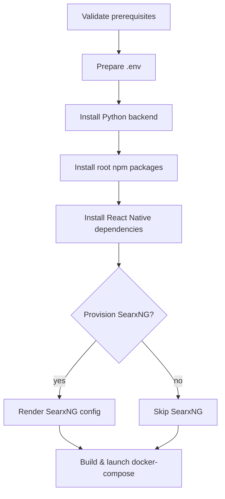

# Full-Stack Deployment Automation

> **Last updated:** 2025-10-24 _(auto-synced; run `python scripts/update_docs_metadata.py`)_

The `scripts/full_stack_visual_deploy.py` helper orchestrates every
prerequisite required to bring the monGARS research stack online. It
wraps environment bootstrapping, dependency installation, optional
SearxNG provisioning, and container launch into a guided, visual
terminal experience. The script is wired into the
[`docs/index.md`](index.md) hub under Operations so engineers can spot
updates at a glance.

## Visual flow



## Usage

```bash
python scripts/full_stack_visual_deploy.py
```

The wizard renders each step with a bordered block, streams command
output for visibility, and writes a combined transcript to
`deployment.log`. Use `--project-root` to target a checked-out
repository elsewhere, `--skip-searx` to omit SearxNG provisioning, or
`--only` with one or more step keys to focus on a subset (for example,
`--only python containers`).

The installer performs the following actions:

1. **Validate prerequisites** – ensures `python3`, `pip`, `npm`,
   `node`, `docker`, and a Compose binary (`docker compose` or
   `docker-compose`) are present.
2. **Prepare environment file** – copies `.env.example` to `.env` if it
   does not already exist, generates secure secrets for FastAPI,
   Django, PostgreSQL, and SearxNG, and adds opinionated SearxNG keys
   (`SEARCH_SEARX_*`).
3. **Install Python backend** – creates `.venv`, upgrades `pip`, and
   installs `requirements.txt` using the virtual environment interpreter.
4. **Install web dependencies** – runs `npm install` in the repository
   root for shared tooling and the Django operator console assets.
5. **Install React Native dependencies** – runs `npm install` inside
   `mobile-app/` and executes `npx pod-install` on macOS when CocoaPods
   is available.
6. **Provision SearxNG** – writes `configs/searxng/settings.yml` if it
   does not exist so the orchestrator can talk to the bundled
   SearxNG instance.
7. **Launch containers** – executes `docker compose pull`, `build`, and
   `up -d` with `docker-compose.searxng.yml` layered on top of
   `docker-compose.yml` when SearxNG is enabled, mirroring the
   production-oriented profile used by `scripts/docker_menu.py` option 11.

Each step key matches the `--only` flag values: `prerequisites`, `env`,
`python`, `root-node`, `mobile`, `searxng`, and `containers`.

## React Native build tips

The automation script prepares dependencies but does not start Metro or
native builds. After it finishes, run the following from `mobile-app/`:

```bash
npm run start           # Launch the Metro bundler
npm run ios -- --device # Build for a connected iOS device or simulator
npm run android         # Build for Android emulator/device
```

On macOS, ensure you have installed the Xcode command-line tools and
run `sudo xcode-select --switch /Applications/Xcode.app`. Android
builds require Android Studio with the SDK manager configured for API
34 or newer.

## Manual override switches

The wizard exits immediately on the first failure when `--non-interactive`
 is supplied. Without the flag it prompts to continue or abort on errors.
To diagnose Compose-specific problems, rerun the container step only:

```bash
python scripts/full_stack_visual_deploy.py --only containers --non-interactive
```

Logs remain in `deployment.log`, ensuring parity between interactive
runs and automated CI usage. Attach that log to incident tickets so the
operations team can compare it with the CI artefacts produced by the
`docker-build` workflow job described in [docs/workflow_reference.md](workflow_reference.md).

## Keeping this runbook current
- Update the step descriptions when `scripts/full_stack_visual_deploy.py`
  changes; mention new CLI flags in both this document and the script docstring.
- Verify the Mermaid flow mirrors the order in `_build_steps()` after any edit.
- When Compose files or secrets management workflows move, cross-link the
  updated locations and bump the "Last updated" banner.
